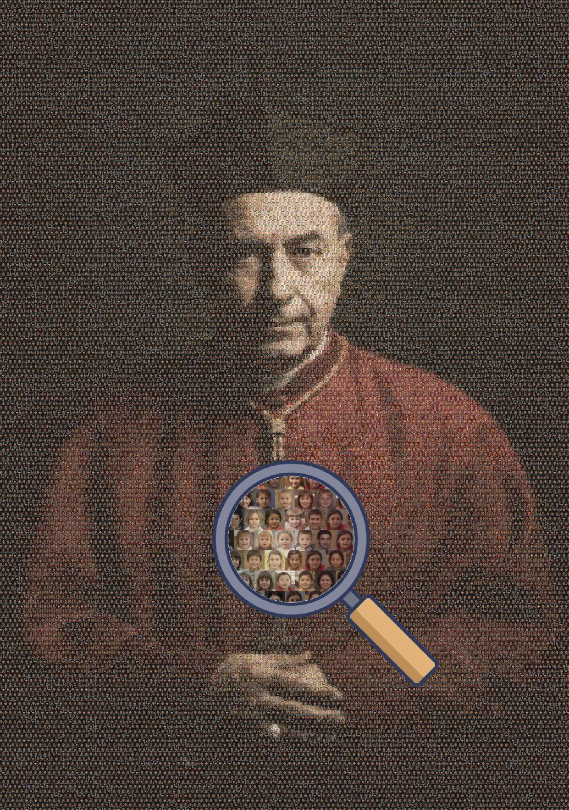

# Innosaint: Structural Photo Mosaic Tool

**Photo Mosaic Tool** is a Python-based project designed to generate high-resolution photo mosaics with a focus on structural matching and artistic subtext.

The project's name Innosaint is a phonetic play on "Innocent." While the code is entirely generic and can be used with any dataset, it was originally conceived to create a provocative piece of art: a portrait of a high-ranking church official (the "Saint") composed entirely of the faces of thousands of non-existent children (the "Innocent"). By using synthetic faces generated via GANs (Generative Adversarial Networks), the project explores themes of institutional abuse and the loss of innocence while maintaining the privacy and legal safety of real individuals.

---

## 🎨 The Concept
image: A 12000x8000 pixel mosaic of a Catholic cardinal, made from over 3,000 synthetic child faces.

> **Note on File Size:** High-quality mosaics generated by this tool (e.g., 12000x8000 pixels) can exceed 90MB. For GitHub reasons, the above image is a lower-resolution preview. 

---

## 🚀 Key Features

* **Structural Matching:** Unlike simple mosaics that only match average colors, this tool uses a  feature window (by default a 4x4) and **KD-Tree** spatial indexing to match the *texture* and *shapes* of the target image.
* **Brick-Pattern Layout:** Implements an alternating row offset (staggered grid) to break up the "digital grid" look, resulting in a more organic, masonry-like appearance.
* **Ghosting/Tinting:** Adjustable alpha blending to subtly mix the target image's colors into the tiles for better coherence. (It's a bit cheaty, but it works!)
* **Synthetic Dataset Generation:** Includes a scraper for `thispersonnotexist.org` to build a library of thousands of unique, non-existent faces.
* **High Performance:** Uses `scipy.spatial.KDTree` for near-instant matching across libraries of N images.

---

## 🛠 Installation

This project uses [uv](https://github.com/astral-sh/uv) for fast, reliable dependency management.

1. **Clone the repository:**
```bash
git clone https://github.com/verbeemen/photo-mosaic
cd photo-mosaic
```


2. **Sync dependencies:**
```bash
uv sync
```

---

## 📖 Usage

The workflow is split into two parts: building your tile library and generating the mosaic.

### 1. Create the Dataset

Run `create_dataset.py` to download and preprocess images for your tile library. By default, it fetches 64x64 pixel images.

```bash
uv run create_dataset.py
```

* **Source:** [thispersonnotexist.org](https://thispersonnotexist.org)
* **Configuration:** You can modify the `Age`, `Race`, and `Emotion` enums in the script to filter the generated faces.

### 2. Generate the Mosaic

Update the configuration constants in `create_photo_mosaic.py` to point to your target image and output path, then run:

```bash
uv run create_photo_mosaic.py
```

**Key Parameters:**

* `FEATURE_SIZE`: The resolution of the structural comparison (default: 4x4).
* `N_TILES_H`: How many tiles to fit across the width (higher = more detail).
* `GHOSTING_ALPHA`: A float between 0.0 and 1.0. Lower values keep tiles "pure"; higher values tint tiles toward the target image colors.

---

## 🔬 Technical Methodology

The algorithm ensures that the "micro" images (the tiles) accurately represent the "macro" image (the target) through a multi-step process:

1. **Feature Extraction:** Every tile in the library is downsampled to a  grid. These 16 pixels (with 3 color channels each) are flattened into a 48-dimensional vector.
2. **Spatial Indexing:** A **KD-Tree** is built from these 48D vectors. This allows the script to find the "mathematically closest" tile to a section of the target image in  time.
3. **Brick Offsets:** To avoid the "spreadsheet" look, every odd row is shifted by half a tile width. The target image is sampled at a matching offset to maintain alignment.
4. **Structural Variety:** Instead of always picking the #1 best match, the script randomly selects from the top 7 candidates, preventing repetitive patterns in areas of flat color.

---

## ⚖️ Ethics and Privacy

The default dataset uses images generated by **thispersonnotexist.org**. These images are created using GANs and do not represent real people. This is a deliberate choice for this project to:

1. **Protect Privacy:** Ensure no real person's likeness is used without consent.
2. **Legal Safety:** Avoid copyright and personality rights issues.
3. **Conceptual Clarity:** Reinforce the idea of "innocence" as a collective, universal concept rather than targeting specific individuals.

---


## Extra
### Fine-Tuning `GHOSTING_ALPHA`

The `GHOSTING_ALPHA` parameter (ranging from `0.0` to `1.0`) is the most important setting for balancing the **visibility of the individual tiles** versus the **clarity of the overall portrait**.

| Alpha Value | Visual Result | Best Use Case |
| --- | --- | --- |
| **0.0 - 0.1** | Raw tiles. The mosaic looks like a collection of distinct photos. The macro image might be hard to see unless the library is perfectly color-matched. | High-contrast target images or very large libraries (>20k images). |
| **0.2 - 0.4** | **The "Sweet Spot".** Tiles are subtly tinted. The macro image is clearly visible, but individual faces remain recognizable upon close inspection. | Most artistic projects, including the "Innosaint" portrait. |
| **0.5 - 0.8** | Heavy tinting. The macro image is very clear, but the tiles lose their individual identity and start to look like "colored pixels." | Low-resolution libraries or target images with very specific, rare color gradients. |

---

### Tips for Better Results

* **Diversity of Dataset:** If your mosaic looks "patchy," run `create_dataset.py` for more iterations. A larger library gives the KD-Tree more options to find a structural match, reducing the need for high `GHOSTING_ALPHA` tinting.
* **Target Image Contrast:** Before running the mosaic script, try increasing the contrast of your target image (the priest/cardinal). Stronger shadows and highlights provide better "anchors" for the structural matching algorithm.
* **Resolution Scaling:** The final mosaic resolution can become very large, very quickly. If you run into memory issues, consider lowering `N_TILES_H` or using smaller tile images (e.g., 32x32 instead of 64x64).

---

### Troubleshooting High-Resolution Exports

Since the final image can be massive (+90MB), here is how to handle the output:

1. **Memory Usage:** The script pre-allocates a large NumPy array. If you run out of RAM, decrease `N_TILES_H` or lower the resolution of the tile images in `create_dataset.py` (e.g., from 64x64 to 32x32).
2. **Viewing:** Most standard web browsers or basic image viewers will struggle with a 100MP+ image. Use professional software like **Adobe Photoshop**, **GIMP**, or a specialized high-res viewer to inspect the results.
3. **Format:** If `.png` files become too large, you can change the final line of `create_photo_mosaic.py` to save as a high-quality `.jpg`:
